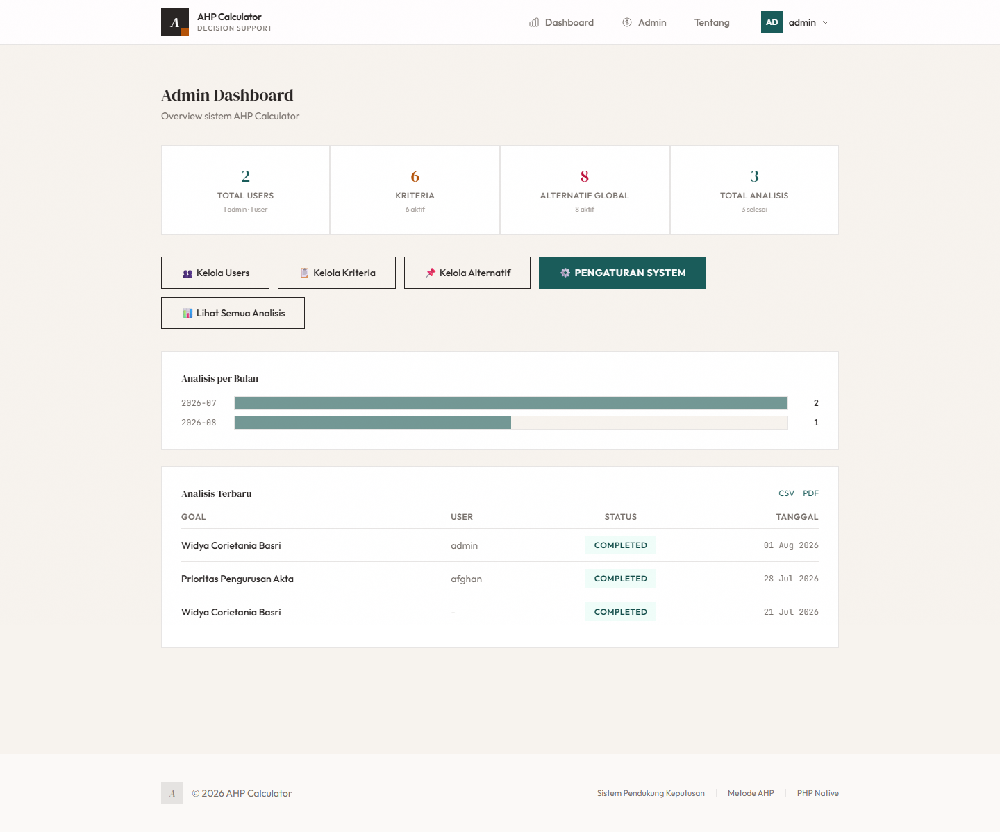
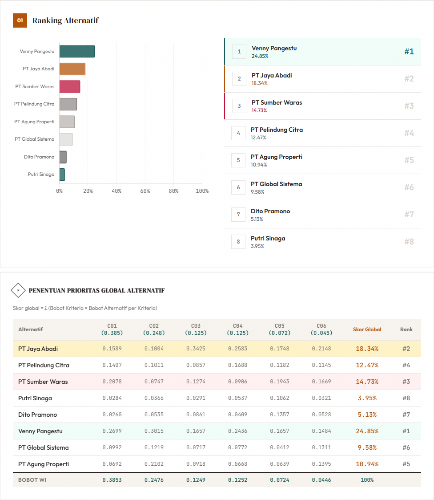

# AHP Calculator

**Sistem Pendukung Keputusan dengan Analytical Hierarchy Process (AHP)**

Aplikasi web berbasis **PHP native** + **MySQL** untuk membantu pengambil keputusan menentukan prioritas pengurusan akta dengan metode **Analytical Hierarchy Process (AHP)**. Dibangun untuk studi kasus *Prioritas Pengurusan Akta di Widya Corietania Basri*.

---

## ✨ Fitur

### Alur Analisis AHP (Wizard 5 Langkah)
- ✅ Input **Goal / Tujuan** keputusan
- ✅ Input **Kriteria Penilaian**
- ✅ Input **Alternatif / Customer** (diambil dari *Manajemen Alternatif Global*)
- ✅ **Perbandingan Berpasangan** antar Kriteria (Skala Saaty 1–9)
- ✅ **Perbandingan Berpasangan** antar Alternatif per Kriteria
- ✅ Perhitungan **Priority Vector (Eigenvector)**
- ✅ **Normalisasi Matriks** & **Bobot Prioritas**
- ✅ **Consistency Check** (CI, RI, CR) + status KONSISTEN/TIDAK KONSISTEN
- ✅ **Matriks Perbandingan Alternatif per Kriteria**
- ✅ **Perankingan Global** akhir alternatif
- ✅ **Simpan Analisis** ke database & **muat** kembali ke sesi

### Manajemen & Laporan
- ✅ **Login / Registrasi** (otentikasi berbasis role)
- ✅ **Halaman Admin**: Dashboard, Manajemen **Users**, **Kriteria**, **Alternatif Global**, **Pengaturan Aplikasi & Laporan**
- ✅ **Profile** pengguna (ubah username, email, password)
- ✅ **Laporan** siap cetak (report.php) untuk: Alternatif/Customer, Kriteria, ...
- ✅ **Laporan Lengkap AHP** (generate_pdf) — kop surat, tandatangan, 9 tahap perhitungan, klien & tanggal
- ✅ **Export** data (users, kriteria, alternatif, analisis)
- ✅ **Visualisasi Bar Chart** ranking alternatif

---

## 🖼️ Tampilan Aplikasi (Screenshot)

Semua tangkapan layar tersimpan dalam folder [`screenshots/`](screenshots).

| Halaman | Screenshot |
|---|---|
| **Login** | `screenshots/01-Login.png` |
| **Menu Utama (Dashboard Admin)** | `screenshots/02-Menu-Utama.png` |
| **Data Customer** | `screenshots/03-Data-Customer.png` |
| **Data Kriteria** | `screenshots/04-Data-Kriteria.png` |
| **Data Sub-Kriteria (per kriteria)** | `screenshots/05-Data-Sub-Kriteria-01.png` … `-06.png` |
| **Penilaian Prioritas (pairwise kriteria)** | `screenshots/06-Penilaian-Prioritas.png` |
| **Perhitungan AHP** | `screenshots/07-Perhitungan-AHP.png` |
| **Laporan Data Customer** | `screenshots/08-Laporan-Data-Customer.png` |
| **Hasil Perhitungan Prioritas** | `screenshots/09-Hasil-Perhitungan-Prioritas.png` |
| **Laporan Data Kriteria** | `screenshots/10-Laporan-Data-Kriteria.png` |
| **Laporan Data Sub-Kriteria** | `screenshots/11-Laporan-Data-Sub-Kriteria-01.png` … `-19.png` |

### Pratinjau menu utama



### Pratinjau hasil perhitungan prioritas



---

## 📋 Persyaratan

- **PHP** 8.0+
- **MySQL** 5.7 / 8.0 (atau MariaDB)
- Ekstensi PHP: `mysqli`, `json`, `session`
- Web browser modern (Chrome, Firefox, Edge, Safari)

---

## 🚀 Instalasi & Menjalankan

### 1. Persiapkan database
- Buat database MySQL, mis. `ahp_calculator`.
- Buka `config.php`, sesuaikan `DB_HOST` / `DB_USER` / `DB_PASS` / `DB_NAME` dengan kredensial hosting/server yang dipakai (default: `localhost`, user `root`, tanpa password — cocok untuk lokal/Laragon/XAMPP, biasanya beda di hosting client).

### 2. Clone/downoload project
```bash
git clone https://github.com/afg2002/ahp-web.git
cd ahp-web
```

### 3. Setup database
Buka browser dan jalankan skrip setup sekali untuk membuat semua tabel, seed data, dan akun admin:

```
http://localhost:8000/setup.php
```

> **Akun super admin default:** username `admin` / password `admin123` — **ganti di produksi!**

> ⚠️ Setelah setup selesai, **hapus `setup.php` dari server** (atau minimal jangan biarkan publik). Script ini terkunci otomatis begitu data kriteria sudah ter-seed, tapi tetap sebaiknya dihapus agar tidak bisa diakses/dijalankan ulang oleh orang lain. Nama aplikasi & identitas instansi bisa diatur belakangan lewat menu **Admin → Pengaturan**, tidak perlu edit kode.

### 4. Jalankan server
Dengan PHP built-in server:
```bash
php -S localhost:8000
```
Lalu akses: [`http://localhost:8000`](http://localhost:8000)

Untuk **Laragon / XAMPP**, cukup letakkan project di folder `www`/`htdocs` dan buka `http://localhost/ahp-web/`.

---

## 🔐 Akun

| Role | Username | Password |
|---|---|---|
| **Super Admin** | `admin` | `admin123` |
| **User biasa** | `user` | (daftar sendiri via halaman Registrasi) |

---

## 🧭 Cara Penggunaan

1. **Login** — login sebagai admin/user (atau daftar akun baru).
2. **Tentukan Goal** (Step 1) — nama keputusan, klien, catatan.
3. **Input Kriteria** (Step 2) — tambahkan faktor penilaian (min. 2).
4. **Input Alternatif** (Step 3) — pilih/kelola alternatif (bisa tambah baru secara *preload* & tambah).
5. **Penilaian Prioritas Kriteria** (Step 4) — bandingkan kepentingan antar kriteria.
6. **Penilaian Alternatif** (Step 5) — bandingkan alternatif utk setiap kriteria.
7. **Hasil** (Results) — lihat bobot prioritas, uji konsistensi, matriks alternatif per kriteria, dan ranking akhir.
8. **Simpan / Muat Analisis** — simpan ke DB, muat kembali kapan saja via dashboard.
9. **Laporan** — buka `Laporan Lengkap AHP`, `report.php?type=...`, atau `export.php` sesuai kebutuhan.

---

## 🗂️ Struktur File

```
ahp-web/
├── index.php              # Router utama & semua handler POST
├── config.php             # Konfigurasi DB, skala Saaty, tabel RI, nama aplikasi
├── database.php           # Koneksi & query builder (MySQL)
├── db_helpers.php         # Helper DB (alternatif global, load/simpan analisis, dll)
├── functions.php          # Engine perhitungan AHP + utilitas
├── setup.php              # Setup database + seed (jalankan sekali)
├── report.php             # Laporan data (users/kriteria/alternatif/analisis)
├── generate_pdf.php       # Laporan lengkap AHP 9 bagian (cetak/PDF)
├── export.php             # Export data (CSV, etc.)
├── views/
│   ├── header.php         # Layout head & navbar
│   ├── footer.php         # Layout footer & scripts
│   ├── _progress.php      # Indikator progres step
│   ├── home.php           # Landing page
│   ├── about.php          # Info AHP (skala Saaty, RI, rumus)
│   ├── auth-login.php     # Halaman login
│   ├── auth-register.php  # Halaman registrasi
│   ├── dashboard.php      # Dashboard pengguna (daftar analisis)
│   ├── step1.php … step5.php  # Wizard input
│   ├── results.php        # Hasil perhitungan AHP
│   ├── view-analysis.php  # Detail analisis dari DB
│   ├── profile.php        # Manajemen profil pengguna
│   ├── admin-dashboard.php   # Dashboard admin
│   ├── admin-users.php       # Manajemen users
│   ├── admin-criteria.php    # Manajemen kriteria
│   ├── admin-alternatives.php# Manajemen alternatif global
│   └── admin-settings.php    # Pengaturan aplikasi & laporan
├── assets/                # CSS, JS (Tailwind, Chart.js), font
├── screenshots/           # Tangkapan layar aplikasi
├── prd.md                 # Product Requirements Document
└── README.md              # Dokumentasi ini
```

---

## 🧪 Teknologi

- **Backend:** PHP 8.x (native, tanpa framework) + **MySQL**
- **Frontend:** Tailwind CSS v4 (Play CDN) + Chart.js untuk visualisasi
- **Font:** Inter (self-hosted + Google Fonts)
- **Session:** PHP Session
- **Otentikasi:** password_hash / password_verify, role `super_admin` / `user`

---

## 📐 Metode AHP

AHP menggunakan skala perbandingan **1–9 (Saaty Scale)**:

| Nilai | Keterangan |
|---|---|
| 1 | Sama penting |
| 3 | Sedikit lebih penting |
| 5 | Lebih penting |
| 7 | Sangat penting |
| 9 | Mutlak lebih penting |
| 2,4,6,8 | Nilai tengah (antara dua penilaian) |
| 1/2 … 1/9 | Kebalikan (kurang penting) |

### Langkah perhitungan
1. **Matriks perbandingan berpasangan** (skala Saaty)
2. **Normalisasi** matriks (bagi tiap sel dengan jumlah kolom)
3. **Priority vector (eigenvector)** = rata-rata tiap baris
4. **λmax** (lambda max) dari weighted sum
5. **Consistency Index** `CI = (λmax − n) / (n − 1)`
6. **Consistency Ratio** `CR = CI / RI`
7. **CR < 0.10** → matriks **KONSISTEN** ✓, hasil dapat diterima

---

## 📄 Lisensi

MIT License — bebas digunakan untuk keperluan belajar, kesripsi, dan komersial.